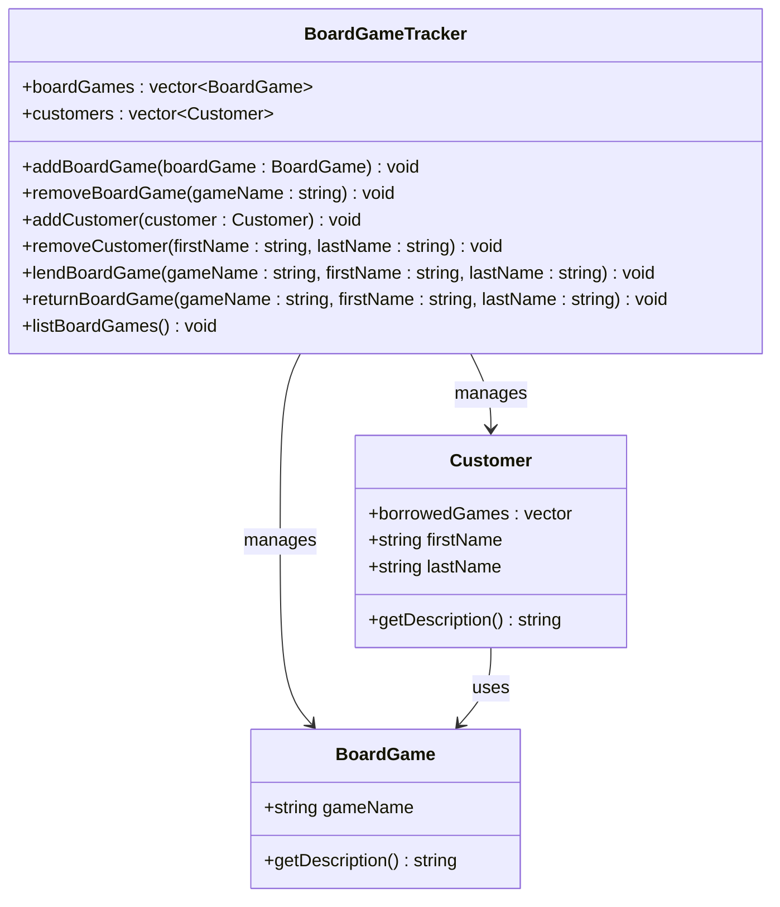

## **Board Game Tracker**
A program for managing and keeping track of board games in storage or lent out. Each board game has a title and each customer can have a board game(s). The user can add and remove board games and lend out board games to customers.

Key Nouns: 
BoardGame
name
Customer 
first name
last name
BoardGameTracker 
board games

Actions: 
Add board game
remove board game
lend board game
return board game
add customer
remove customer

