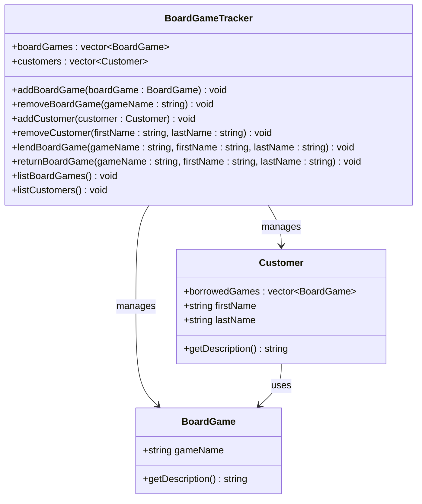

## **Board Game Tracker**
A program for managing and keeping track of board games in storage or lent out. Each board game has a title and each customer can have a board game(s). The user can add and remove board games and lend out board games to customers.

## **Nouns and Verbs**
Key Nouns: 
BoardGame
name
Customer 
first name
last name
BoardGameTracker 
board games

Actions: 
Add board game
remove board game
lend board game
return board game
add customer
remove customer

## **Class Definitions**
```cpp
// BoardGame.h
class BoardGame {
public:
		string gameName;
		string getDescription();
};

// Customer.h
class Customer {
public:
	vector<BoardGame> borrowedGames;
	string firstName;
	string lastName;
	string getDescription();
};

// BoardGameTracker.h
class BoardGameTracker {
public:
	vector<BoardGame> boardGames;
	vector<Customer> customers;
	void addBoardGame(BoardGame boardGame);
	void removeBoardGame(string gameName);
	void addCustomer(Customer customer);
	void removeCustomer(string firstName, string lastName);
	void lendBoardGame(string gameName, string firstName, string lastName);
	void returnBoardGame(string gameName, string firstName, string lastName);
	void listBoardGames();
	void listCustomers();
};
```

## **Class Diagram**

