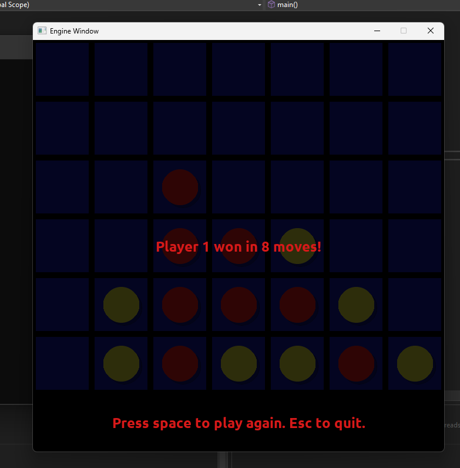

# Project 04 - Connect Four

## Description

This is a turn-based grid game written in C++ using SDL2. Players take turns placing pieces using the mouse. Pieces are dropped in chosen columns.

## Controls

Left mouse click to place a piece
Press 'space' to restart game
Press 'esc' to quit game

## Screenshot

## Extra Features

Sound effects when placing a piece
Highlighting current player

